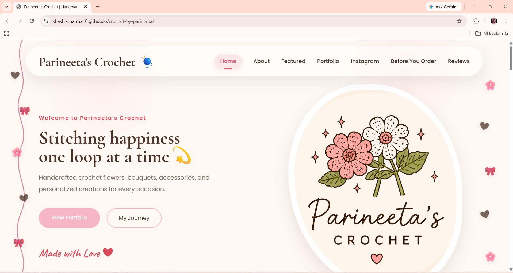
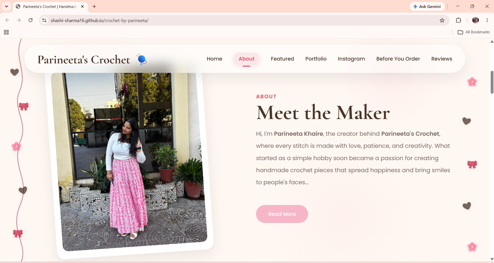
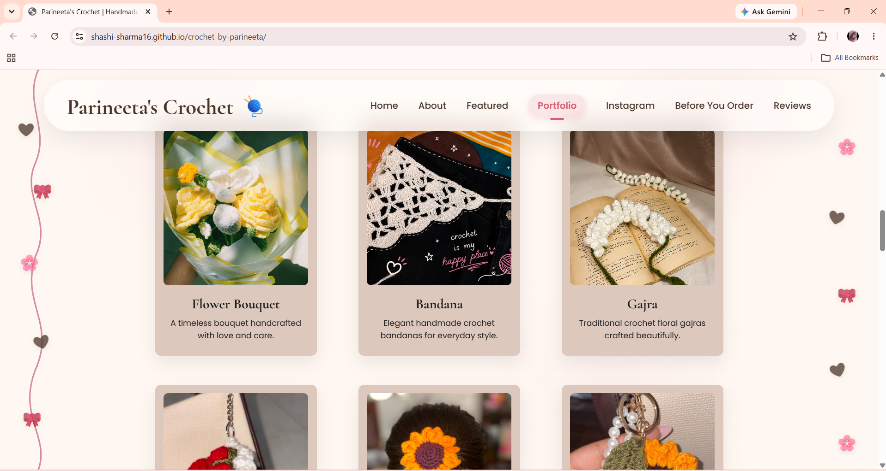
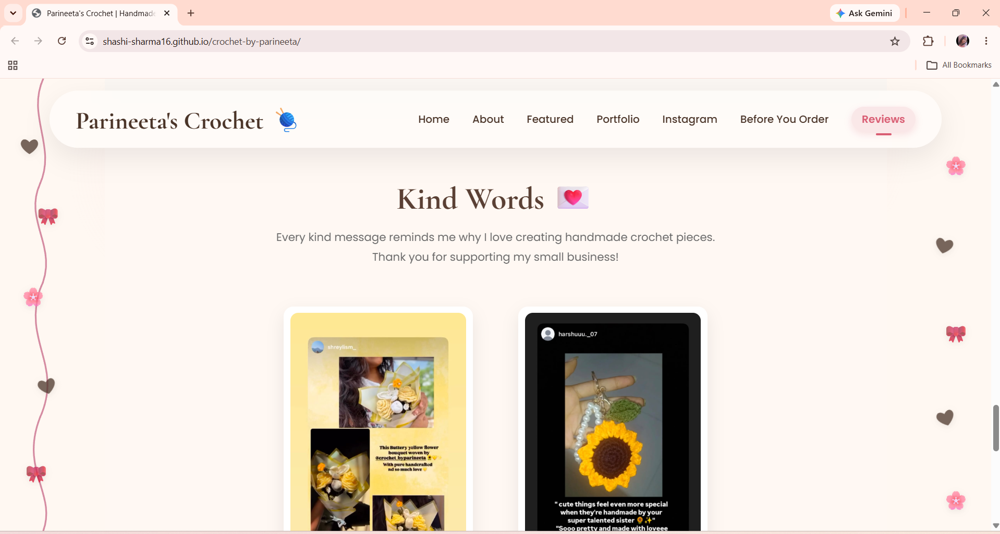

# 🧶 Crochet by Parineeta

A responsive portfolio landing page designed and developed for **Crochet by Parineeta**, a handmade crochet business. The website showcases handcrafted crochet creations, introduces the creator, highlights customer reviews, and provides a seamless way for customers to place orders through Instagram.

## 🌐 Live Demo

🔗 https://shashi-sharma16.github.io/crochet-by-parineeta/

## 📖 Project Overview

This project was created to establish an elegant online presence for a small handmade crochet business. Instead of building a full e-commerce platform, the goal was to design a visually appealing portfolio website that reflects the brand's personality while making it easy for visitors to explore products and connect through Instagram.

## ✨ Features

- 🎨 Elegant and modern user interface
- 📱 Fully responsive design for desktop, tablet, and mobile devices
- 🏠 Interactive Hero section
- 👩 About the Creator section
- 🌸 Featured Crochet Collection
- 🖼️ Portfolio Gallery
- ⭐ Customer Reviews
- ❓ FAQ / Before You Order section
- 📷 Instagram integration for placing orders
- 🍔 Mobile-friendly navigation menu
- 🎯 Smooth scrolling navigation

## 🛠️ Built With

- HTML5
- CSS3
- JavaScript
- Git
- GitHub
- GitHub Pages

## 📱 Responsive Design

Optimized for:

- Desktop
- Laptop
- Tablet
- Mobile Devices

## 🚀 Live Website

https://shashi-sharma16.github.io/crochet-by-parineeta/

## 📂 Project Structure

```text
crochet-portfolio/
│
├── assets/
├── css/
├── images/
│   ├── artist/
│   ├── gallery/
│   ├── hero/
│   └── reviews/
│
├── js/
├── screenshots/
│
├── index.html
└── README.md
```

## 🎯 Objectives

- Create a professional online portfolio for a small business.
- Deliver a responsive experience across multiple screen sizes.
- Maintain an elegant and aesthetic visual identity.
- Provide customers with a simple way to explore products and place orders.

## 📌 Future Improvements

- Product search and filtering
- Contact form
- Dark mode
- Performance optimization
- SEO improvements
- Custom domain integration

## 👨‍💻 Developer

**Shashi Sharma**

GitHub: https://github.com/shashi-sharma16

---

⭐ If you found this project interesting, consider giving it a star!

## 📸 Website Preview

### 🏠 Home



### 👩 About



### 🧶 Portfolio



### ⭐ Customer Reviews

